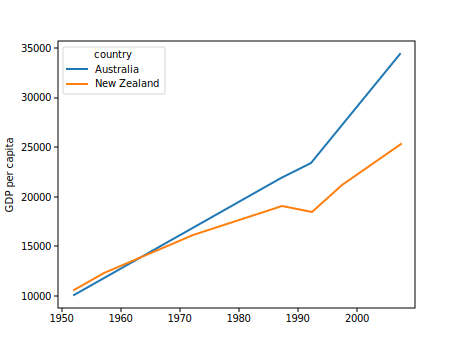

::::::::::::::::::::::::::::::::::::::: objectives

- Crea un gráfico de series temporales mostrando un único conjunto de datos.
- Crea un gráfico de dispersión que muestra la relación entre dos conjuntos de datos.

::::::::::::::::::::::::::::::::::::::::::::::::::

:::::::::::::::::::::::::::::::::::::::: questions

- ¿Cómo puedo representar mis datos?
- ¿Cómo puedo guardar mi gráfico para publicarlo?

::::::::::::::::::::::::::::::::::::::::::::::::::

## [`matplotlib`](https://matplotlib.org/) es la librería de gráficos científicos más utilizada en Python.

- Comúnmente usa una sub-biblioteca llamada
  [`matplotlib.pyplot`](https://matplotlib.org/stable/tutorials/introductory/pyplot.html).
- Por defecto, Jupyter Notebook muestra los gráficos en línea.

```python
import matplotlib.pyplot as plt
```

- Los gráficos simples son (bastante) fáciles de crear.

```python
time = [0, 1, 2, 3]
position = [0, 100, 200, 300]

plt.plot(time, position)
plt.xlabel('Time (hr)')
plt.ylabel('Position (km)')
```

{alt='Un gráfico de líneas que muestra el tiempo
(hr) relativo a la posición (km), utilizando los valores proporcionados en el bloque de
código anterior. Por defecto, la línea trazada es azul sobre fondo blanco, y los ejes se
han escalado automáticamente para ajustarse al rango de los datos de entrada.'}

::::::::::::::::::::::::::::::::::::::::: callout

## Mostrar todas las figuras abiertas

En nuestro ejemplo de Jupyter Notebook, la ejecución de la celda debería generar la
figura directamente debajo del código. La figura también se incluye en el documento de
Notebook para su futura visualización. Sin embargo, otros entornos Python como una
sesión Python interactiva iniciada desde un terminal o un script Python ejecutado a
través de la línea de comandos requieren un comando adicional para mostrar la figura.

Indica a `matplotlib` que muestre una figura:

```python
plt.show()
```

Este comando también puede usarse dentro de un Cuaderno - por ejemplo, para mostrar
múltiples figuras si varias son creadas por una sola celda.

::::::::::::::::::::::::::::::::::::::::::::::::::

## Trazar datos directamente desde un [`Pandas dataframe`](https://pandas.pydata.org/pandas-docs/stable/reference/api/pandas.DataFrame.html).

- También podemos graficar [Pandas
  dataframes](https://pandas.pydata.org/pandas-docs/stable/generated/pandas.DataFrame.html).
- Antes de graficar, convertimos los encabezados de columna de un tipo de datos `string`
  a `integer`, ya que representan valores numéricos, usando
  [str.replace()](https://pandas.pydata.org/docs/reference/api/pandas.Series.str.replace.html)
  para eliminar el prefijo `gpdPercap_` y luego
  [astype(int)](https://pandas.pydata.org/docs/reference/api/pandas.Series.astype.html)
  para convertir la serie de valores de cadena (`['1952', '1957', ..., '2007']`) a una
  serie de enteros: `[1925, 1957, ..., 2007]`.

```python
import pandas as pd

data = pd.read_csv('data/gapminder_gdp_oceania.csv', index_col='country')

# Extraer el año de los últimos 4 caracteres de cada nombre de columna  
# Los nombres actuales de las columnas tienen la estructura 'gdpPercap_(año)',  
# por lo que queremos conservar solo la parte del (año) para mayor claridad al graficar PIB vs. años  
# Para ello usamos replace(), que elimina de la cadena los caracteres indicados en el argumento  
# Este método funciona con cadenas, así que usamos replace() desde las funciones vectorizadas de cadenas de Pandas: Series.str

years = data.columns.str.replace('gdpPercap_', '')

# Convierte los valores de los años a integers, guardando los resultados de vuelta

data.columns = years.astype(int)

data.loc['Australia'].plot()
```

{alt='Gráfico del PIB de Australia'}

## Selecciona y transforma los datos, luego los grafica.

- Por defecto,
  [`DataFrame.plot`](https://pandas.pydata.org/pandas-docs/stable/generated/pandas.DataFrame.plot.html#pandas.DataFrame.plot)
  traza con las filas como eje X.
- Podemos transponer los datos para graficar múltiples series.

```python
data.T.plot()
plt.ylabel('GDP per capita')
```

{alt='Gráfico del PIB de Australia y Nueva Zelanda'}

## Hay muchos estilos disponibles.

- Por ejemplo, haga un gráfico de barras usando un estilo más elegante.

```python
plt.style.use('ggplot')
data.T.plot(kind='bar')
plt.ylabel('GDP per capita')
```

{alt='Gráfico de barras del PIB de Australia'}

## Los datos también pueden ser graficados llamando directamente a la función `matplotlib` `plot`.

- El comando es `plt.plot(x, y)`
- El color y el formato de los marcadores también se puede especificar como un argumento
  opcional adicional, por ejemplo, `b-` es una línea azul, `g--` es una línea
  discontinua verde.

## Obtener datos de Australia del marco de datos

```python
years = data.columns
gdp_australia = data.loc['Australia']

plt.plot(years, gdp_australia, 'g--')
```

{alt='Gráfico del PIB con formato de Australia'}

## Puede graficar varios conjuntos de datos juntos.

```python
# Select two countries' worth of data.
gdp_australia = data.loc['Australia']
gdp_nz = data.loc['New Zealand']

# Plot with differently-colored markers.
plt.plot(years, gdp_australia, 'b-', label='Australia')
plt.plot(years, gdp_nz, 'g-', label='New Zealand')

# Create legend.
plt.legend(loc='upper left')
plt.xlabel('Year')
plt.ylabel('GDP per capita ($)')
```

::::::::::::::::::::::::::::::::::::::::: callout

## Añadir una leyenda

A menudo, cuando se trazan múltiples conjuntos de datos en la misma figura, es deseable
tener una leyenda que describa los datos.

Esto se puede hacer en `matplotlib` en dos etapas:

- Proporciona una etiqueta para cada conjunto de datos en la figura:

```python
plt.plot(years, gdp_australia, label='Australia')
plt.plot(years, gdp_nz, label='New Zealand')
```

- Indica a `matplotlib` que cree la leyenda.

```python
plt.legend()
```

Por defecto matplotlib intentará colocar la leyenda en una posición adecuada. Si
prefiere especificar una posición, puede hacerlo con el argumento `loc=`, por ejemplo,
para colocar la leyenda en la esquina superior izquierda del gráfico, especifique
`loc='upper left'`

::::::::::::::::::::::::::::::::::::::::::::::::::

{alt='Gráfico con formato del PIB de Australia
y Nueva Zelanda'}

- Traza un gráfico de dispersión correlacionando el PIB de Australia y Nueva Zelanda
- Utilice `plt.scatter` o `DataFrame.plot.scatter`

```python
plt.scatter(gdp_australia, gdp_nz)
```

{alt='Correlación del PIB mediante plt.scatter'}

```python
data.T.plot.scatter(x = 'Australia', y = 'New Zealand')
```

{alt='Correlación del PIB usando
data.T.plot.scatter'}

::::::::::::::::::::::::::::::::::::::: challenge

## Mínimos y Máximos

Rellena los espacios en blanco siguientes para representar el PIB per cápita mínimo a lo
largo del tiempo para todos los países de Europa. Modifícalo de nuevo para trazar el PIB
per cápita máximo a lo largo del tiempo para Europa.

```python
data_europe = pd.read_csv('data/gapminder_gdp_europe.csv', index_col='country')
data_europe.____.plot(label='min')
data_europe.____
plt.legend(loc='best')
plt.xticks(rotation=90)
```

::::::::::::::: solution

## Solución

```python
data_europe = pd.read_csv('data/gapminder_gdp_europe.csv', index_col='country')
data_europe.min().plot(label='min')
data_europe.max().plot(label='max')
plt.legend(loc='best')
plt.xticks(rotation=90)
```

{alt='Solución Mínima Máxima'}


:::::::::::::::::::::::::

::::::::::::::::::::::::::::::::::::::::::::::::::

::::::::::::::::::::::::::::::::::::::: challenge

## Correlaciones

Modifica el ejemplo de las notas para crear un gráfico de dispersión que muestre la
relación entre el PIB per cápita mínimo y máximo entre los países de Asia para cada año
del conjunto de datos. ¿Qué relación observas (si la hay)?

::::::::::::::: solution

## Solución

```python
data_asia = pd.read_csv('data/gapminder_gdp_asia.csv', index_col='country')
data_asia.describe().T.plot(kind='scatter', x='min', y='max')
```

{alt='Correlaciones Solución 1'}

No se aprecian correlaciones particulares entre los valores mínimos y máximos del PIB
año tras año. Parece que las fortunas de los países asiáticos no suben y bajan juntas.


:::::::::::::::::::::::::

Puedes observar que la variabilidad del máximo es mucho mayor que la del mínimo. Eche un
vistazo a los índices máximo y máximo:

```python
data_asia = pd.read_csv('data/gapminder_gdp_asia.csv', index_col='country')
data_asia.max().plot()
print(data_asia.idxmax())
print(data_asia.idxmin())
```

::::::::::::::: solution

## Solución

{alt='Correlaciones Solución 2'}

Parece que la variabilidad de este valor se debe a una fuerte caída después de 1972.
¿Tal vez haya algo de geopolítica en juego? Dado el predominio de los países productores
de petróleo, tal vez el índice del crudo Brent sería una comparación interesante
Mientras que Myanmar tiene sistemáticamente el PIB más bajo, la nación con el PIB más
alto ha variado más notablemente.


:::::::::::::::::::::::::

::::::::::::::::::::::::::::::::::::::::::::::::::

::::::::::::::::::::::::::::::::::::::: challenge

## Más Correlaciones

Este breve programa crea un gráfico que muestra la correlación entre el PIB y la
esperanza de vida para 2007, normalizando el tamaño del marcador por la población:

```python
data_all = pd.read_csv('data/gapminder_all.csv', index_col='country')
data_all.plot(kind='scatter', x='gdpPercap_2007', y='lifeExp_2007',
              s=data_all['pop_2007']/1e6)
```

Utilizando la ayuda en línea y otros recursos, explique qué hace cada argumento de
`plot`.

::::::::::::::: solution

## Solución

{alt='Más correlaciones Solución'}

Un buen lugar para buscar es la documentación de la función plot - help(data\_all.plot).

tipo - Como ya se ha visto, determina el tipo de gráfico que se dibujará.

x e y - Un nombre de columna o índice que determina qué datos se colocarán en los ejes x
e y del gráfico

s - Encontrará más detalles en la documentación de plt.scatter. Un solo número o un
valor para cada punto de datos. Determina el tamaño de los puntos trazados.


:::::::::::::::::::::::::

::::::::::::::::::::::::::::::::::::::::::::::::::

::::::::::::::::::::::::::::::::::::::::: callout

## Guardar el gráfico en un archivo

Si estás satisfecho con el gráfico que ves, puede que quieras guardarlo en un archivo,
tal vez para incluirlo en una publicación. Hay una función en el módulo
matplotlib.pyplot que hace esto:
[savefig](https://matplotlib.org/stable/api/_as_gen/matplotlib.pyplot.savefig.html).
Llamando a esta función, por ejemplo con

```python
plt.savefig('my_figure.png')
```

guardará la figura actual en el archivo `my_figure.png`. El formato del archivo se
deducirá automáticamente de la extensión del nombre del archivo (otros formatos son pdf,
ps, eps y svg).

Tenga en cuenta que las funciones en `plt` se refieren a una variable de figura global y
después de que una figura se ha mostrado en la pantalla (por ejemplo, con `plt.show`)
matplotlib hará que esta variable se refiera a una nueva figura vacía. Por lo tanto,
asegúrese de llamar a `plt.savefig` antes de que el gráfico se muestre en pantalla, de
lo contrario puede encontrar un archivo con un gráfico vacío.

Cuando se usan dataframes, los datos son a menudo generados y graficados en pantalla en
una sola línea. Además de usar `plt.savefig`, podemos guardar una referencia a la figura
actual en una variable local (con `plt.gcf`) y llamar al método de clase `savefig` desde
esa variable para guardar la figura en un fichero.

```python
data.plot(kind='bar')
fig = plt.gcf() # get current figure
fig.savefig('my_figure.png')
```

::::::::::::::::::::::::::::::::::::::::::::::::::

::::::::::::::::::::::::::::::::::::::::: callout

## Haciendo sus gráficos accesibles

Siempre que estés generando gráficos para un artículo o una presentación, hay algunas
cosas que puedes hacer para asegurarte de que todo el mundo pueda entender tus gráficos.

- Asegúrese siempre de que su texto es lo suficientemente grande como para ser leído.
  Utilice el parámetro `fontsize` en `xlabel`, `ylabel`, `title`, y `legend`, y
  [`tick_params` con
  `labelsize`](https://matplotlib.org/stable/api/_as_gen/matplotlib.axes.Axes.tick_params.html)
  para aumentar el tamaño del texto de los números en sus ejes.
- Del mismo modo, debe hacer que los elementos de su gráfico sean fáciles de ver.
  Utilice `s` para aumentar el tamaño de sus marcadores de dispersión y `linewidth` para
  aumentar el tamaño de sus líneas de trazado.
- El uso del color (y nada más) para distinguir entre los diferentes elementos del
  gráfico hará que sus gráficos sean ilegibles para cualquiera que sea daltónico, o que
  tenga una impresora de oficina en blanco y negro. Para las líneas, el parámetro
  `linestyle` le permite utilizar diferentes tipos de líneas. Para los gráficos de
  dispersión, `marker` le permite cambiar la forma de sus puntos. Si no está seguro de
  sus colores, puede utilizar
  [Coblis](https://www.color-blindness.com/coblis-color-blindness-simulator/) u [Oráculo
  de colores](https://colororacle.org/) para simular el aspecto que tendrían sus
  gráficos para las personas daltónicas.

::::::::::::::::::::::::::::::::::::::::::::::::::

:::::::::::::::::::::::::::::::::::::::: keypoints

- [`matplotlib`](https://matplotlib.org/) es la librería de gráficos científicos más
  utilizada en Python.
- Traza datos directamente desde un marco de datos Pandas.
- Selecciona y transforma datos, luego los grafica.
- Dispone de muchos estilos de representación gráfica: consulte la [Galería gráfica de
  Python](https://python-graph-gallery.com/matplotlib/) para más opciones.
- Puede graficar varios conjuntos de datos juntos.

::::::::::::::::::::::::::::::::::::::::::::::::::


